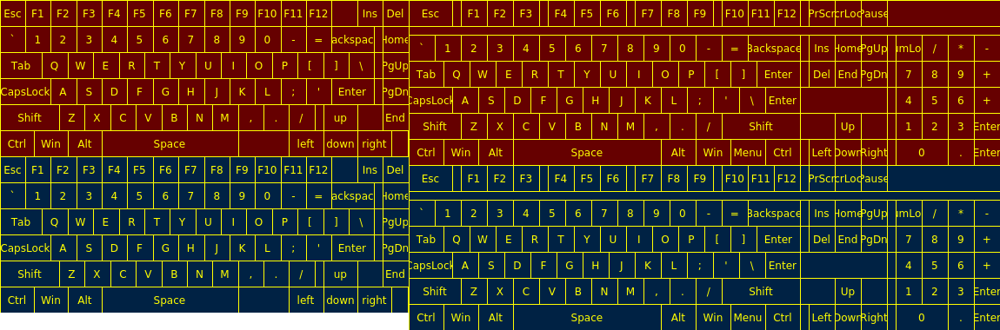

# 10930_screenkeyboard_image_drawer

## DESCRIPTION

```

Program 10930_screenkeyboard_image_drawer

SYNOPSIS:
    10930_screenkeyboard_image_drawer --generateBareDescriptor [--help]
    10930_screenkeyboard_image_drawer [--gui] [--generate-sprite <path-to-file>] [--generate-sprite-builder <path-to-directory>] <sourceFile> [--help]

OPTIONS:

--help
    print this message and close immediatelly

--gui
    if set then result in window will be shown

--generate-sprite <path-to-file>
    result sprite will be written as sprite

SOURCE FILE FORMAT:
Source file is a JSON-file with content like following:
 {
     "variants": [
         {
             "orientation": "v",
             "layouts": ["ru","en"],
             "width": 512,
             "height": 300,
             "buttons": {
                 "width": 24,
                 "height": 10,
                 "rows": [
                     "2: Ctrl:4 Win:16 Ctrl:4",
                     "2: Ctrl:4 Win:20",
                     "3: Ctrl:4 Win:8 Space:8 Ctrl:4",
                     "3: Ctrl:4 Win Alt:4 Space:8 Ctrl:4"
                 ]
             }
         },
         {
             "orientation": "v",
             "layouts": ["ru","en"],
             "width": 256,
             "height": 300,
             "buttons": {
                 "width": 24,
                 "height": 10,
                 "rows": [
                     "2: Ctrl:4 Win:16 Ctrl:4",
                     "2: Ctrl:4 Win:20",
                     "3: Ctrl:4 Win:8 Space:8 Ctrl:4",
                     "3: Ctrl:4 Win Alt:4 Space:8 Ctrl:4"
                 ]
             }
         }
     ]
 }
Variant button rows description:
Example: "3: Ctrl:4 Win Alt:4 Space:8 Ctrl:4".
          ┬  ──┬─ ┬ ─┬─
          └ row height (3)
               └ Button identifier (Ctrl)
                  └ Button width (4)
                     └ Button identifier (Win). The button width not set, so it's width will be taken as for previous button, i.e. equal 4.
Buttons separated with ' '(space symbol(s))
For each button may be set button width - after ':'-symbol. For first button in row it is required to be set button width.
So we have row with height 3 and 5 buttons with the following widths: 4 for Ctrl, 4 for Win (as previous by default), 4 for Alt, 8 for Space, 4 for Ctrl

Variant width - width in pixels
Variant.buttons width - width in internal units. The same units used for row heights and buttons widths.

```

## USAGE EXAMPLE
For input file
```json
{
    "variants": [
        {
            "orientation": "v",
            "layouts": ["ru", "en"],
            "width": 470,
            "height": 180,
            "buttons": {
                "width": 48,
                "height": 18,
                "rows": [
                    "3: Esc:3 F1 F2 F3 F4 F5 F6 F7 F8 F9 F10 F11 F12 :3 Ins:3 Del",
                    "3: `:3 1 2 3 4 5 6 7 8 9 0 - = Backspace:5 :1 Home:3",
                    "3: Tab:5 Q:3 W E R T Y U I O P [ ] \\ :1 PgUp:3",
                    "3: CapsLock:6 A:3 S D F G H J K L ; ' Enter:5 :1 PgDn:3",
                    "3: Shift:7 Z:3 X C V B N M , . / :1 up:4 :3 End:3",
                    "3: Ctrl:4 Win Alt Space:16 :6 left:4 down right :2"
                ]
            }
        },
        {
            "orientation": "v",
            "layouts": ["ru", "en"],
            "width": 680,
            "height": 190,
            "buttons": {
                "width": 68,
                "height": 19,
                "rows": [
                    "3: Esc:5 :1 F1:3 F2 F3 :1 F4:3 F5 F6 :1 F7:3 F8 F9 :1 F10:3 F11 F12 :1 PrScr:3 ScrLock Pause :13",
                    "1: :68",
                    "3: `:3 1 2 3 4 5 6 7 8 9 0 - = Backspace:6 :1 Ins:3 Home PgUp :1 NumLock:3 / * -",
                    "3: Tab:4 Q:3 W E R T Y U I O P [ ] Enter:5 :1 Del:3 End PgDn :1 7:3 8 9 +",
                    "3: CapsLock:5 A:3 S D F G H J K L ; ' \\ Enter:4 :10 :1 4:3 5 6 +",
                    "3: Shift:6 Z:3 X C V B N M , . / Shift:9 :4 Up:3 :3 :1 1:3 2 3 Enter",
                    "3: Ctrl:4 Win Alt Space:17 Alt:4 Win:4 Menu Ctrl :1 Left:3 Down Right :1 0:6 .:3 Enter"
                ]
            }
        }
    ]
}
```
we taken the following result:



## LICENCE

Copyright © 2021 [Васильев Борис](https://github.com/1024sparrow)

Published under [MIT license](LICENSE).

